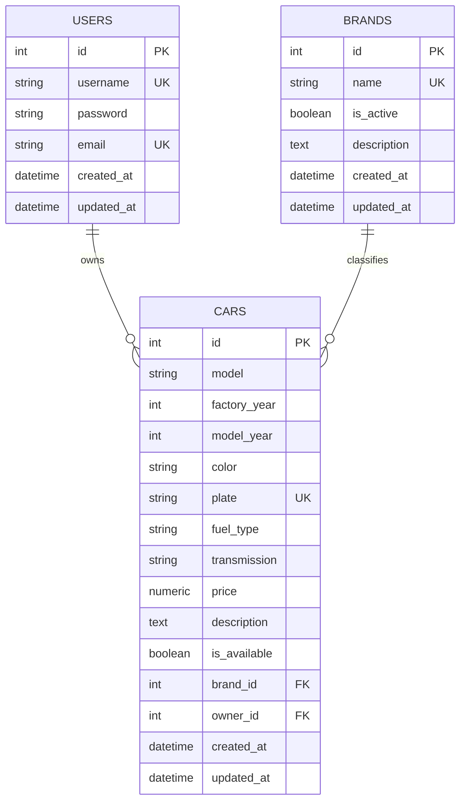
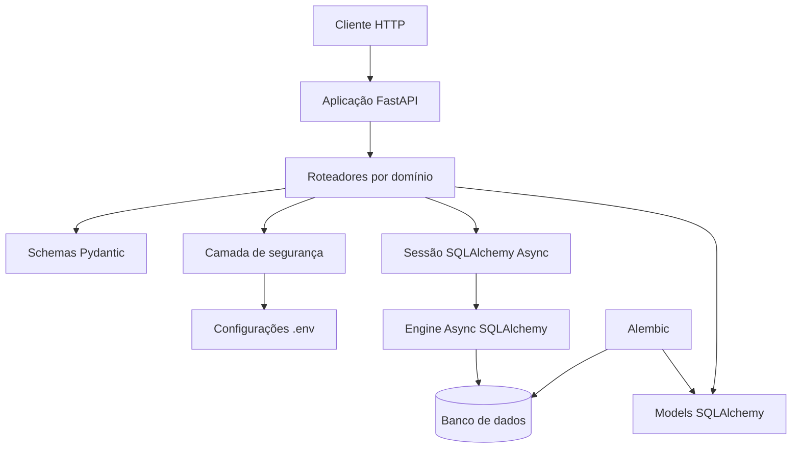
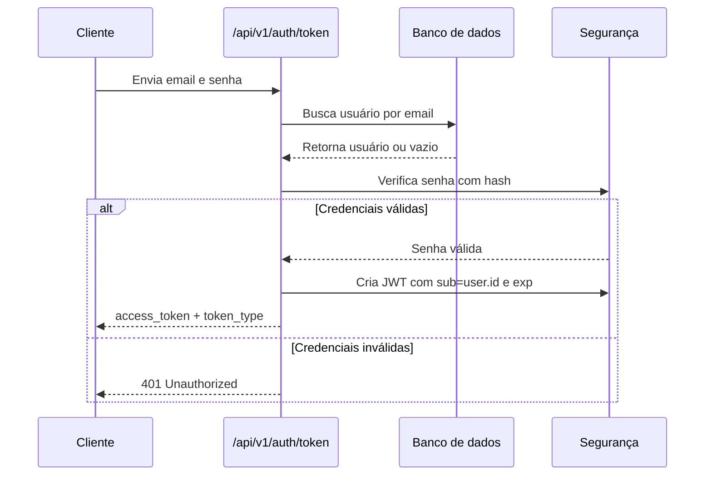
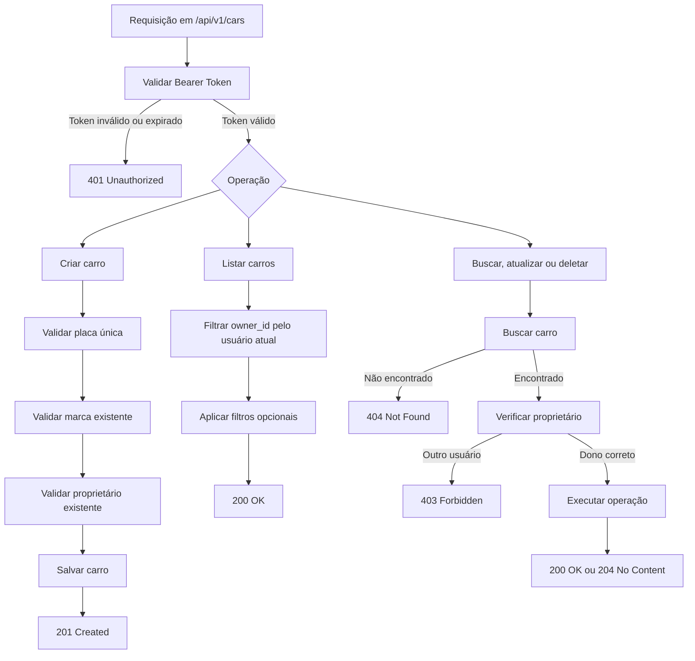
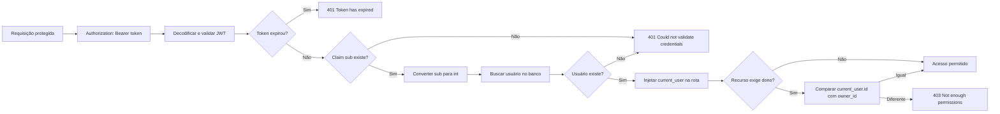

# Modelagem do Sistema

## Modelos de Dados

```mermaid
erDiagram
    USERS ||--o{ CARS : owns
    BRANDS ||--o{ CARS : classifies

    USERS {
        int id PK
        string username UK
        string password
        string email UK
        datetime created_at
        datetime updated_at
    }

    BRANDS {
        int id PK
        string name UK
        boolean is_active
        text description
        datetime created_at
        datetime updated_at
    }

    CARS {
        int id PK
        string model
        int factory_year
        int model_year
        string color
        string plate UK
        string fuel_type
        string transmission
        numeric price
        text description
        boolean is_available
        int brand_id FK
        int owner_id FK
        datetime created_at
        datetime updated_at
    }
```

## Arquitetura do Sistema

```mermaid
flowchart TD
    Client[Cliente HTTP] --> FastAPI[Aplicação FastAPI]
    FastAPI --> Routers[Roteadores por domínio]
    Routers --> Schemas[Schemas Pydantic]
    Routers --> Security[Camada de segurança]
    Routers --> Session[Sessão SQLAlchemy Async]
    Security --> Settings[Configurações .env]
    Session --> Engine[Engine Async SQLAlchemy]
    Engine --> Database[(Banco de dados)]
    Alembic[Alembic] --> Database
    Alembic --> Models[Models SQLAlchemy]
    Routers --> Models
```

## Fluxo de Autenticação

```mermaid
sequenceDiagram
    participant Client as Cliente
    participant Auth as /api/v1/auth/token
    participant DB as Banco de dados
    participant Security as Segurança

    Client->>Auth: Envia email e senha
    Auth->>DB: Busca usuário por email
    DB-->>Auth: Retorna usuário ou vazio
    Auth->>Security: Verifica senha com hash
    alt Credenciais válidas
        Security-->>Auth: Senha válida
        Auth->>Security: Cria JWT com sub=user.id e exp
        Auth-->>Client: access_token + token_type
    else Credenciais inválidas
        Auth-->>Client: 401 Unauthorized
    end
```

## Fluxo CRUD de Carros

```mermaid
flowchart TD
    Start[Requisição em /api/v1/cars] --> Auth[Validar Bearer Token]
    Auth -->|Token inválido ou expirado| Unauthorized[401 Unauthorized]
    Auth -->|Token válido| Action{Operação}

    Action --> Create[Criar carro]
    Create --> ValidatePlate[Validar placa única]
    ValidatePlate --> ValidateBrand[Validar marca existente]
    ValidateBrand --> ValidateOwner[Validar proprietário existente]
    ValidateOwner --> SaveCar[Salvar carro]
    SaveCar --> ReturnCreated[201 Created]

    Action --> List[Listar carros]
    List --> OwnerFilter[Filtrar owner_id pelo usuário atual]
    OwnerFilter --> ApplyFilters[Aplicar filtros opcionais]
    ApplyFilters --> ReturnList[200 OK]

    Action --> ReadUpdateDelete[Buscar, atualizar ou deletar]
    ReadUpdateDelete --> FindCar[Buscar carro]
    FindCar -->|Não encontrado| NotFound[404 Not Found]
    FindCar -->|Encontrado| Ownership[Verificar proprietário]
    Ownership -->|Outro usuário| Forbidden[403 Forbidden]
    Ownership -->|Dono correto| Execute[Executar operação]
    Execute --> ReturnResult[200 OK ou 204 No Content]
```

## Fluxo de Segurança

```mermaid
flowchart LR
    Request[Requisição protegida] --> Header[Authorization: Bearer token]
    Header --> Decode[Decodificar e validar JWT]
    Decode --> Exp{Token expirou?}
    Exp -->|Sim| Expired[401 Token has expired]
    Exp -->|Não| Subject{Claim sub existe?}
    Subject -->|Não| Invalid[401 Could not validate credentials]
    Subject -->|Sim| Parse[Converter sub para int]
    Parse --> UserLookup[Buscar usuário no banco]
    UserLookup --> Exists{Usuário existe?}
    Exists -->|Não| Invalid
    Exists -->|Sim| CurrentUser[Injetar current_user na rota]
    CurrentUser --> ResourceRule{Recurso exige dono?}
    ResourceRule -->|Não| Allowed[Acesso permitido]
    ResourceRule -->|Sim| Ownership[Comparar current_user.id com owner_id]
    Ownership -->|Igual| Allowed
    Ownership -->|Diferente| Forbidden[403 Not enough permissions]
```
